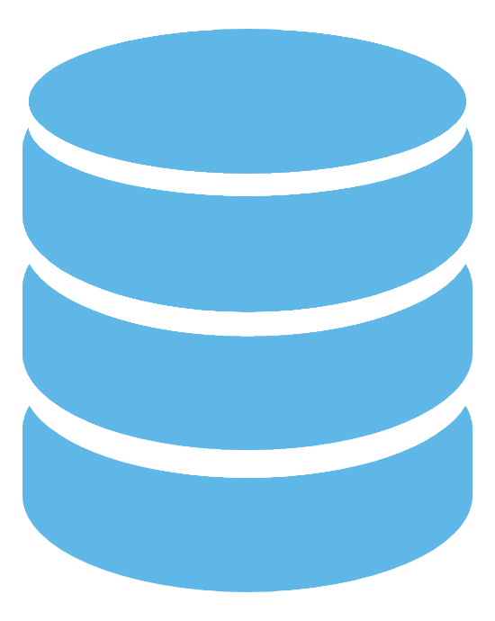

[![Youtube][youtube-shield]][youtube-url]
[![Facebook][facebook-shield]][facebook-url]
[![Facebook Page][facebook-shield]][facebook-group-url]
[![Instagram][instagram-shield]][instagram-url]
[![LinkedIn][linkedin-shield]][linkedin-url]
[![VS Code Theme][vscode-shield]][vscode-theme-url]

<!-- PROJECT LOGO -->
 

    
    <h3 align="center">
        <a href="https://github.com/rdbms-rockstar" target="_blank" >
            Be A RDBMS Rockstar
        </a>
    </h3>

## Modules

- [Module 48: Database Essentials & Relational Model](./module-48/README.md)
- [Module 49: Database Normalization, Postgres Installation, and Application Insights](./module-49/README.md)
- [Module 50: PostgreSQL Essentials](./module-50/README.md)

## Contact

- Email: [noyonrahman2003@gmail.com](mailto:noyonrahman2003@gmail.com)
- LinkedIn: [Noyon Rahman](https://linkedin.com/in/noyonalways)

<!-- MARKDOWN LINKS & IMAGES -->

[youtube-shield]: https://img.shields.io/badge/-Youtube-black.svg?style=round-square&logo=youtube&color=555&logoColor=white
[youtube-url]: https://youtube.com/@deskofnoyon
[facebook-shield]: https://img.shields.io/badge/-Facebook-black.svg?style=round-square&logo=facebook&color=555&logoColor=white
[facebook-url]: https://facebook.com/noyonalways
[facebook-group-url]: https://facebook.com/webbronoyon
[instagram-shield]: https://img.shields.io/badge/-Instagram-black.svg?style=round-square&logo=instagram&color=555&logoColor=white
[instagram-url]: https://instagram.com/noyonalways
[linkedin-shield]: https://img.shields.io/badge/-LinkedIn-black.svg?style=round-square&logo=linkedin&colorB=555
[linkedin-url]: https://linkedin.com/in/noyonalways
[vscode-shield]: https://img.shields.io/badge/-VS%20Code%20Theme-black.svg?style=round-square&logo=visualstudiocode&colorB=555
[vscode-theme-url]: https://marketplace.visualstudio.com/items?itemName=noyonalways.codevibe-themes
